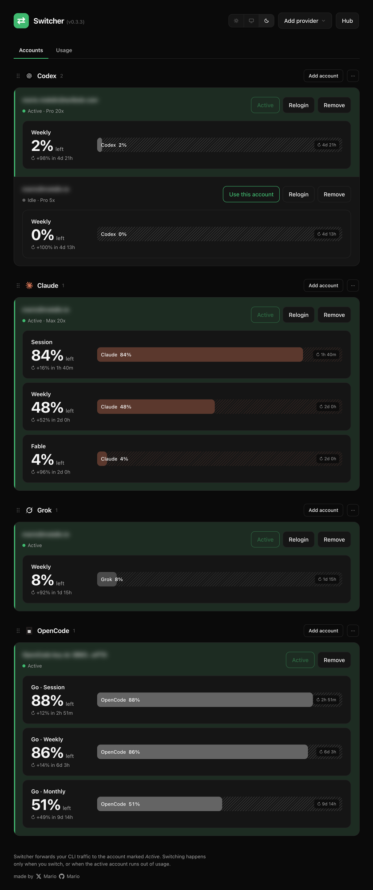
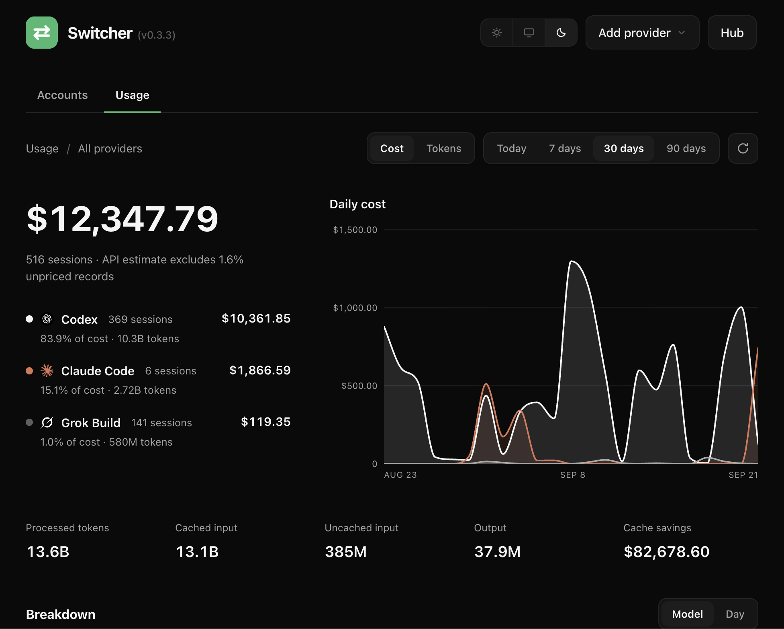
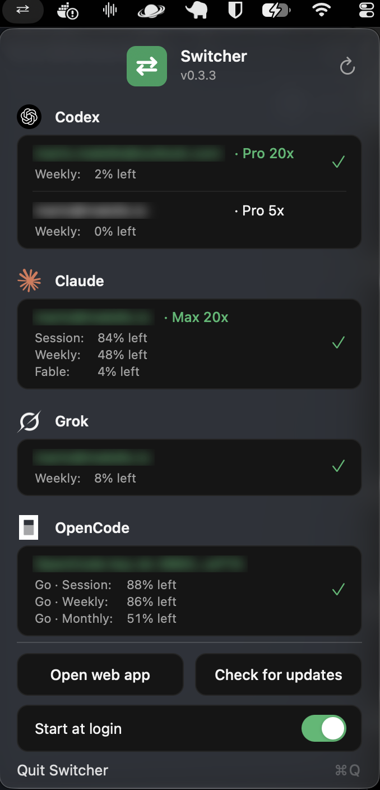

# Switcher

A tiny local tool for switching your AI CLI logins between accounts on demand.

One active account serves all traffic. Switching happens **only** when you
switch, or when the active account runs out of usage, in which case Switcher
moves to another account and retries transparently.

```
codex CLI ──▶ Switcher (127.0.0.1:8787) ──▶ upstream, signed in as the active account
                    ▲
                    └── web UI: add / switch / remove accounts
```

| Accounts | Usage | Menu bar |
|---|---|---|
|  |  |  |

## Why

Tools that juggle multiple paid subscriptions are usually built to serve many
users from many accounts at the same time. That is a different problem from
yours, and the features they pile on exist for it:

- **Rotation pools** exist to saturate a set of subscriptions: spread every
  request across all accounts so the aggregate never trips one account's
  rate limit. That matters when one account cannot absorb the load, which is
  a team or reseller problem. For one person coding, it almost never is, and
  the cost is real: you can no longer tell which subscription is being
  billed, and the system makes routing decisions you never asked for.
- **Cooldown schedulers** are circuit breakers for big credential fleets.
  When one account out of many fails, bench it so the rest keep flowing.
  With a small fleet this backfires: benching half of your accounts for a
  minute over a two second network blip turns a hiccup into a lockout.

Switcher answers two questions instead:

- **Which account am I using right now?**
- **Switch me to another one** (yourself, with one click, or automatically
  when the active one is out of usage).

One account is chosen, all traffic is billed to it, and that choice never
changes on its own.

Protocol translation (letting a client speak one wire format to an upstream
that speaks another) is deliberately left open. It is genuinely useful and
may be added later.

Everything else is deliberately missing. No API keys, no model aliases, no
round-robin, no plugins.

## Features

- **Manual switching, only from you**: switching never happens on its own
  as long as the active account works. Use the web UI or the menu bar
  dropdown.
- **Automatic failover on exhaustion**: when the active account reports it
  is out of usage (HTTP 429 `usage_limit_reached`), Switcher marks it with
  the upstream reset time and, if another account is usable, retries your
  in-flight request on it transparently.
- **No switch when there is nowhere to go**: if every account is out of
  usage, Switcher does not rotate; it passes the upstream error through.
- **Per-account usage windows**: session / weekly / monthly limits with
  reset countdowns, live in the web UI and the menu bar dropdown.
- **Cost and tokens**: a Usage tab that reads the provider CLIs' own
  session logs (like ccusage does) and prices them with LiteLLM rates:
  daily cost chart, per-provider and per-model breakdowns, cache savings.
- **Login without logging in**: the Claude login imports the Claude Code
  CLI's tokens from the macOS keychain, so if you use Claude Code you do
  not sign in again at all.
- **Relogin per account**: sign in again in one click; the tokens overwrite
  the account in place, keeping its id, active slot, and history.
- **Banked resets**: Codex usage-limit resets can be spent from the UI.
- **T3 Code hub**: speaks CLIProxyAPI's management protocol, so T3 Code
  shows every account's quota from one place.
- **Menu bar app**: the macOS app supervises the server, shows every
  account's usage and plan, switches, refreshes, and updates itself.
- **Single Go binary**: the frontend is embedded; there is no Node build.
  Dark and light themes, drag-to-reorder providers, hide providers you
  do not use.

## Providers

| Provider | Login | Status |
|---|---|---|
| Codex (ChatGPT Plus / Pro / Team) | browser OAuth | supported |
| Claude (Pro / Max, subscription) | imports the Claude Code CLI login, or browser OAuth | supported |
| Grok (Build) | device-code flow | supported |
| OpenCode | API key | supported |
| Antigravity (Google) | Google OAuth, onboards the cloud project automatically | supported |
| Gemini (CLI login) | Google OAuth (same plumbing as Antigravity) | supported |
| GitHub Copilot | GitHub device flow; imports the VS Code Copilot login when present | supported |

The `provider.Provider` interface (login, refresh, forward, usage) is the
only integration point; a new provider is one package.

## Install

### macOS app (recommended)

1. Grab the latest `Switcher_<version>.dmg` from
   [Releases](https://github.com/00xmario/switcher/releases/latest).
2. Open the DMG and drag **Switcher.app** into **Applications**.
3. Eject the DMG after copying.
4. Launch Switcher from Applications. It starts a menu bar icon (`⇄`) plus
   the local server on `127.0.0.1:8787`.

Switcher is signed ad-hoc because it ships outside the App Store without a
paid Developer ID, so macOS Gatekeeper may block the first launch. Clear the
quarantine flag once with:

```sh
xattr -dr com.apple.quarantine /Applications/Switcher.app
```

Then launch normally. To have it start at login, open the menu bar dropdown
and enable **Start at login**.

### From source

Requires Go 1.27+.

```sh
git clone https://github.com/00xmario/switcher && cd switcher
make install          # builds and puts `switcher` on your PATH
```

## Quick start

```sh
switcher                 # serves the UI + proxy on http://127.0.0.1:8787
switcher install         # points the codex CLI at Switcher (idempotent, backs up config)
```

1. Open <http://127.0.0.1:8787>.
2. **Add accounts**: Codex opens the normal ChatGPT sign-in; Claude imports
   the Claude Code CLI's login from the keychain (or signs in); Grok uses a
   device code; OpenCode takes an API key.
3. Click **Use this account** to make it active. Check the **Usage** tab
   for cost and token breakdowns, and **Settings** to set a password or
   expose the server to your LAN.
4. Run `codex`, `claude`, `grok`, or `opencode` as usual. That's it.

`switcher uninstall` removes Switcher from the codex config again (a
`.switcher-backup` copy of your config is kept alongside it).

## Switching rules, precisely

| Situation | Behaviour |
|---|---|
| You click *Use this account* | marks it active from now on |
| No account was ever activated | the first usable account (by email order) serves traffic |
| Active account returns 429 `usage_limit_reached` | mark it exhausted until the upstream reset time; switch to another usable account and retry the request transparently |
| Every account is out of usage | no rotation; the upstream error is passed through |
| A 429 that is *not* a usage-limit error (e.g. burst limit) | passed through, nothing marked, no switch |
| Active account's token expired | refreshed via its refresh token before use |
| Token refresh fails (account needs re-login) | parked for an hour; traffic moves to another account |

## Security model

- **Default: local only, no authentication.** The server binds `127.0.0.1`
  and nothing leaves the machine, which is why the default install has no
  login. This is the same trust model as the CLIs themselves.
- **Optional authentication.** The Settings tab can require a password
  (PBKDF2-SHA256, 600k iterations, hashed with a per-user salt; sessions
  are random tokens stored only as SHA-256 hashes with a 7-day sliding
  expiry, HttpOnly SameSite=Strict cookies, CSRF-protected mutations, and
  login lockout). A local device token lets the menu bar app authenticate
  without a browser.
- **LAN exposure, opt-in and TLS-only.** Once a password is set, a
  second listener can bind the LAN IP; it is always TLS (self-signed
  ECDSA certificate, regenerated automatically when your IP changes) and
  the local listener stays plain HTTP so the CLIs need no changes. Know
  the edges: the CLI proxy paths and the management-key hub stay reachable
  on the LAN, so only enable this on networks you trust.
- Hardened headers everywhere: CSP (no inline script, form-action self),
  nosniff, no-referrer. State-changing requests from a non-loopback socket
  are refused for credential routes.
- Tokens are stored unencrypted under `~/.switcher/` with `0600`
  permissions, same trust model as the CLIs themselves.
- Request bodies are forwarded verbatim; Switcher never inspects prompts.

Forgot your password? Delete `~/.switcher/settings.json` and restart
Switcher; authentication resets to off.

## Layout

```
main.go                  entry point + subcommands (serve / install / uninstall)
internal/config/         paths and defaults
internal/store/          account + state persistence (atomic JSON writes)
internal/provider/       provider contract
internal/provider/codex/ Codex OAuth + upstream details
internal/login/          browser login orchestration
internal/proxy/          request forwarding + the switching rules
internal/codexcfg/       codex config.toml installer (idempotent)
internal/usage/          cost and token usage from the CLIs' own session logs
internal/mgmtapi/        CLIProxyAPI-compatible hub surface for T3 Code
internal/update/         self-update from GitHub releases
build/macos/             the menu bar app (single-file Swift) and packaging
web/                     dependency-free frontend (served from the binary)
```

## Development

```sh
make dev      # run with the frontend served from web/ (SWITCHER_DEV=1)
```

In dev mode the UI is served straight from disk: edit a file in `web/`,
refresh the browser, and the change is live. No rebuild, no restart.

Go changes still need a rebuild and restart. That is a deliberate trade:
all routing state (active account, exhaustion windows) lives in
`state.json`, so a restart is instant and lossless, and building a custom
in-process hot reloader would add real complexity for near-zero benefit.
If you want watch-and-restart for Go code anyway, the standard
[air](https://github.com/air-verse/air) tool works fine with Switcher.

## Disclaimer

Switcher is an unofficial tool and is not affiliated with OpenAI, Anthropic,
or xAI. It proxies your own accounts on your own machine; what you do with
that is your business and your responsibility.

## License

MIT. See [LICENSE](LICENSE).
