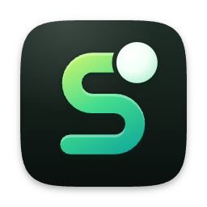
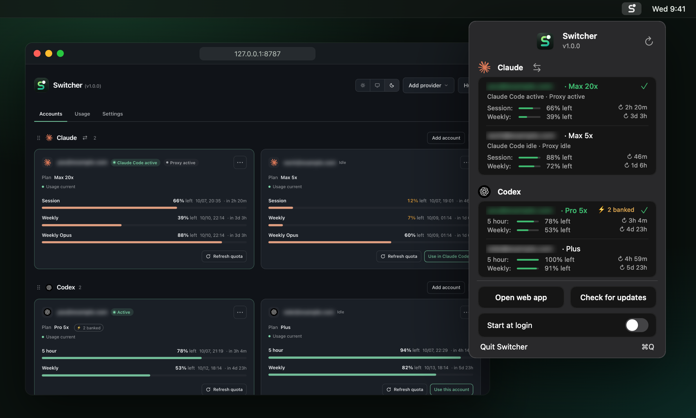
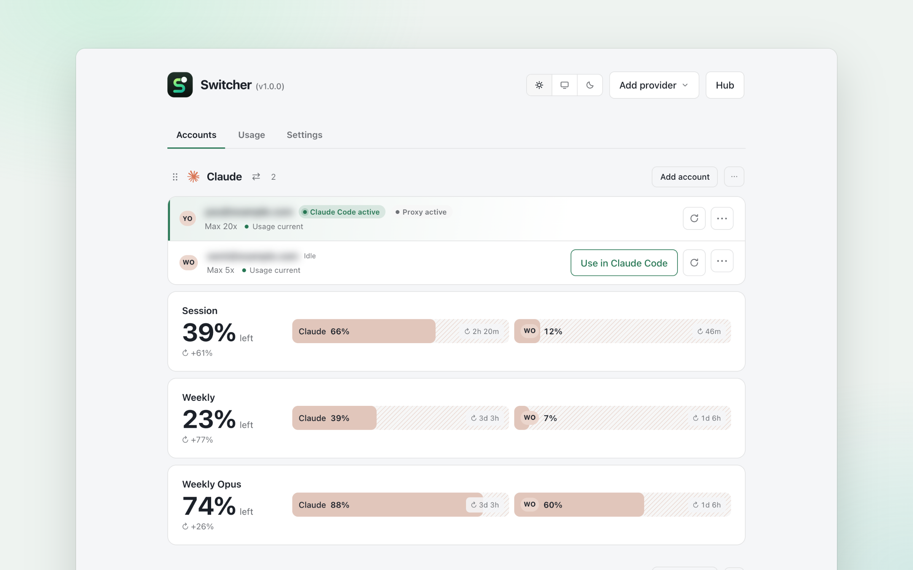
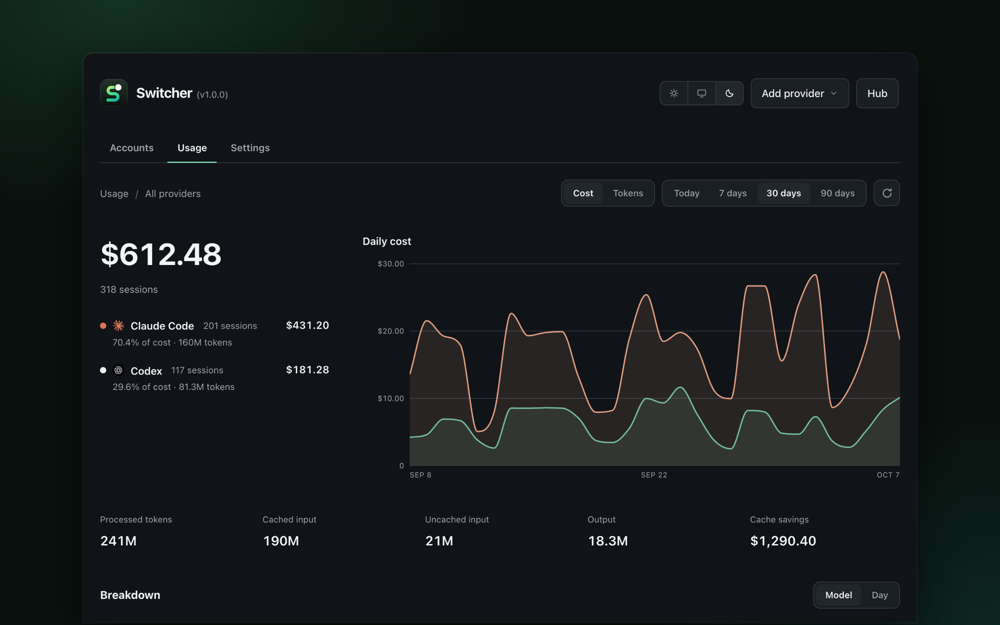
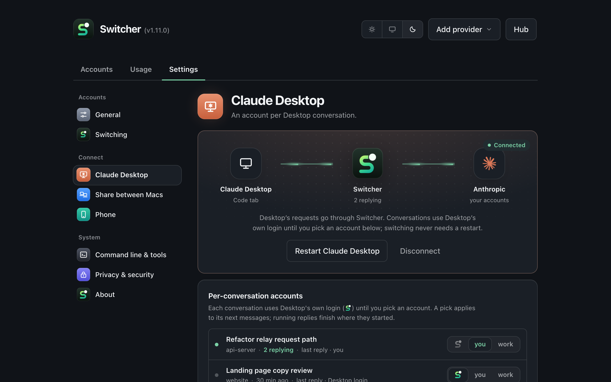
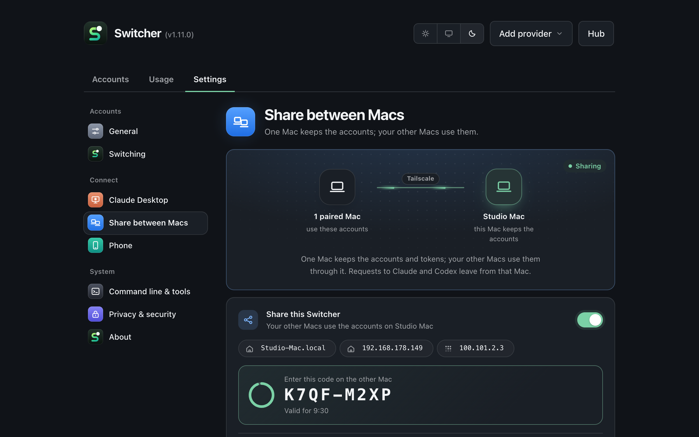
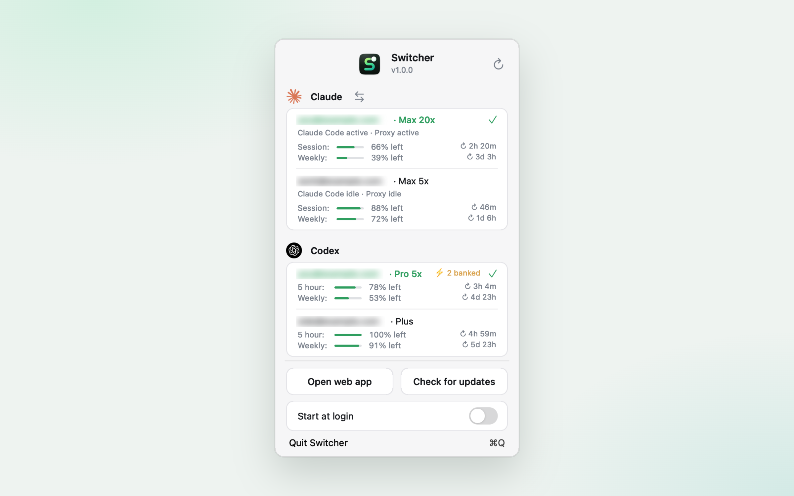
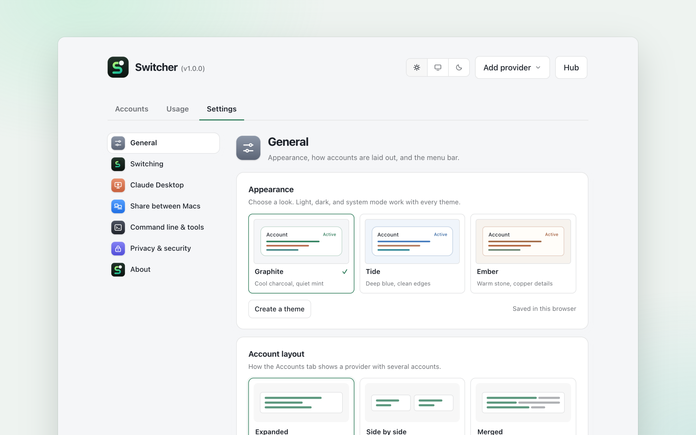
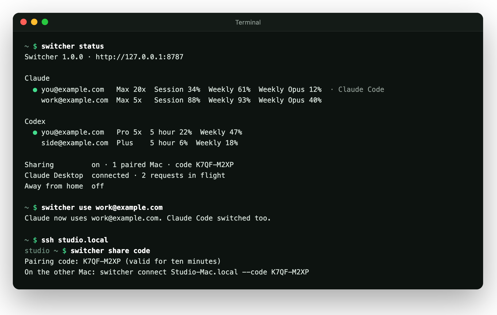

<p align="center">
  
</p>

<h1 align="center">Switcher</h1>

<p align="center">
  <strong>One harness, all your AI accounts.</strong><br>
  Switch Claude Code, Codex and Claude Desktop between your own subscriptions in one click,<br>
  from the menu bar, the dashboard or the command line.
</p>

<p align="center">
  <a href="https://github.com/00xmario/switcher/releases/latest"><strong>Download for macOS</strong></a>
  &nbsp;·&nbsp; <a href="#command-line">Command line</a>
  &nbsp;·&nbsp; <a href="docs/sharing.md">Share between Macs</a>
  &nbsp;·&nbsp; <a href="docs/details.md">Details</a>
</p>

<p align="center">
  
</p>

## Why Switcher

You pay for more than one subscription and want your tools to use the right
one, without logging out, editing config files or interrupting the agents that
are already running. Switcher sits between your tools and the providers on
your own Mac and answers two questions: **which account am I using**, and
**switch me to that one**.

It does not pool accounts, rotate requests between them or invent its own
rate limits. Each provider uses the account you picked until you pick another,
or until that account reports it is out of usage. Errors and limits are the
provider's own.

## Highlights

- **One click, every tool.** *Use in Claude Code* switches Claude Code's own
  login and Switcher's proxy together; running sessions follow within about
  30 seconds. Codex, the T3 Code hub and, if you want, Claude Desktop use the
  account you pick.
- **Never stuck at a limit.** When the active account reports it is out of
  usage, Switcher retries your request on another paid account. A banked
  Codex reset comes before a Free account, so you keep the paid models.
- **Every quota at a glance.** Session, weekly and monthly windows with reset
  countdowns, in the dashboard and the menu bar, side by side per account if
  you merge them. Optional alerts when a window resets.
- **Share between Macs.** Pair your laptop with your desktop once. Accounts
  and tokens stay on one Mac and the others use them, at home or anywhere
  with the optional Tailscale add-on.
- **On your phone.** Check usage, switch Codex accounts and spend a banked
  reset from your phone, over Tailscale. Only phones you approve on the Mac
  get in.
- **A command line for you and your agents.** Switch, sign in, share between
  Macs and set up Claude Desktop from a terminal or over SSH, with JSON output
  and stable exit codes.
- **Costs and tokens.** A Usage tab reads your CLIs' own session logs and
  prices them, per day, provider and model.
- **Claude Desktop per conversation.** Optional: pick an account for
  individual Desktop conversations, with no restart per switch.
- **Private by default.** Local only, no telemetry, prompts never inspected,
  and account emails blurred until you hover.

<table>
  <tr>
    <td width="50%"><br><sub><b>Merged accounts.</b> Every account side by side per quota window.</sub></td>
    <td width="50%"><br><sub><b>Costs and tokens.</b> From your CLIs' own session logs.</sub></td>
  </tr>
  <tr>
    <td><br><sub><b>Claude Desktop.</b> An account per conversation, one click each.</sub></td>
    <td><br><sub><b>Share between Macs.</b> Pair once with a code.</sub></td>
  </tr>
  <tr>
    <td><br><sub><b>Menu bar.</b> Usage and switching without opening anything.</sub></td>
    <td><br><sub><b>Settings.</b> Themes, layouts and every option, explained.</sub></td>
  </tr>
</table>

## Install

```sh
curl -fsSL https://raw.githubusercontent.com/00xmario/switcher/main/install.sh | sh
```

The script installs the latest release into Applications, adds the
`switcher` command and starts Switcher. It works over SSH too.

Or download `Switcher_<version>.dmg` from
[Releases](https://github.com/00xmario/switcher/releases/latest) and drag
Switcher into Applications. Switcher is signed ad hoc rather than with a paid
Developer ID, so macOS may block the first launch of a browser download;
clear the flag once with:

```sh
xattr -dr com.apple.quarantine /Applications/Switcher.app
```

Switcher lives in the menu bar and serves its dashboard on
<http://127.0.0.1:8787>. Turn on **Start at login** in its menu to keep it
around. To build from source (Go 1.27+): `make install`.

## Quick start

1. **Add accounts.** Open the dashboard from the menu bar and click
   **Add account**, or run `switcher login claude`. Claude can also import the
   login Claude Code already has.
2. **Switch.** Click **Use in Claude Code** or **Use this account**, or run
   `switcher use work@example.com`.
3. **Point Codex at Switcher** once: `switcher setup codex`, or
   **Settings → CLI setup**.

Your other Macs can skip all of this: `switcher connect <this Mac> --code <code>`
lets them use this Mac's accounts. See [sharing](docs/sharing.md).

## Command line

<p align="center">
  
</p>

```sh
switcher status                            # accounts, usage, sharing, Claude Desktop
switcher use work@example.com              # switch; Claude also switches Claude Code
switcher login claude                      # sign in, also over SSH
switcher share on && switcher share code   # let your other Macs use this one
switcher connect studio.local --code K7QF-M2XP
switcher desktop connect                   # route Claude Desktop through Switcher
switcher status --json                     # for agents and scripts
```

**Signing in over SSH works.** Open the printed link in a browser on any
device. The browser ends on a `localhost` page that cannot load; paste that
address back into the command and Switcher finishes the sign-in on its own
Mac. Agents use `--no-wait --json` and `switcher login finish`. Everything is
in the [command line guide](docs/cli.md).

## Providers

| Provider | Sign in | What Switcher does |
|---|---|---|
| **Claude** | Browser, or import Claude Code's login | Switches Claude Code's own login and the Claude proxy; optional Claude Desktop routing |
| **Codex** | ChatGPT in the browser | Proxy for the Codex CLI, one-command setup, banked resets |
| **Grok Build** | Device code | Proxy for the session service |
| **OpenCode Go** | API key | Proxy |
| **Gemini, Antigravity** | Google in the browser | Accounts and usage |
| **GitHub Copilot** | Device code, or import Copilot CLI | Accounts and usage |

The full matrix, including what is verified per native CLI, is in
[details](docs/details.md#providers-and-native-cli-readiness).

## Privacy and security

- By default Switcher listens on `127.0.0.1` only and needs no account of its
  own. Requests go straight from your Mac to the provider, with your tokens.
- Tokens stay in `~/.switcher/` (mode `0600`), like the CLIs keep theirs.
  Request bodies are forwarded as they are; Switcher never reads prompts.
- Sharing between Macs uses a pinned certificate, a pairing code proved in
  both directions and a revocable token per Mac, and only accepts your own
  network and Tailscale.
- An optional dashboard password and an opt-in TLS LAN listener are in
  Settings. The full model is in [details](docs/details.md#security-model).

## Documentation

- [Switcher in detail](docs/details.md): every feature, the switching rules, security
- [Command line](docs/cli.md): commands, JSON for agents, signing in over SSH
- [Share between Macs](docs/sharing.md): pairing, Away from home, what follows the host
- [Switcher on your phone](docs/phone.md): setup and who can get in
- [Claude Desktop](docs/desktop-relay-usage.md): per-conversation accounts
- [All documentation](docs/README.md), including development notes

## Development

```sh
make dev       # serve the UI from web/ (refresh to see changes)
make verify    # every check that runs before a release
```

The frontend is plain JavaScript embedded in a single Go binary; the menu bar
app is one Swift file. See [details](docs/details.md#layout) for the layout.

## Disclaimer

Switcher is an unofficial tool and is not affiliated with Anthropic, OpenAI,
xAI, Google or GitHub. It uses your own accounts on your own machine; what you
do with that is your responsibility.

## License

MIT. See [LICENSE](LICENSE) and [third-party notices](THIRD_PARTY_NOTICES.md).
Run `switcher licenses` to read the bundled notices.
